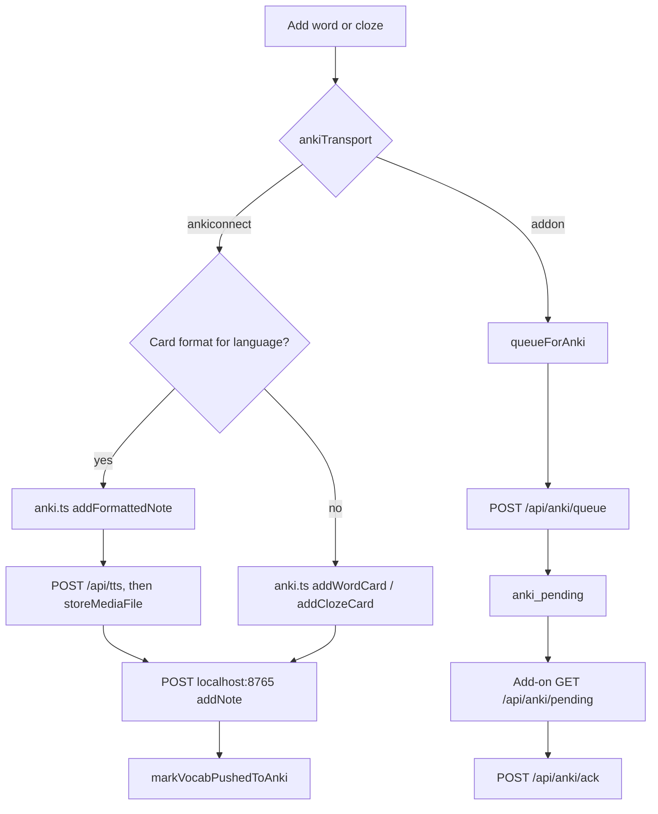
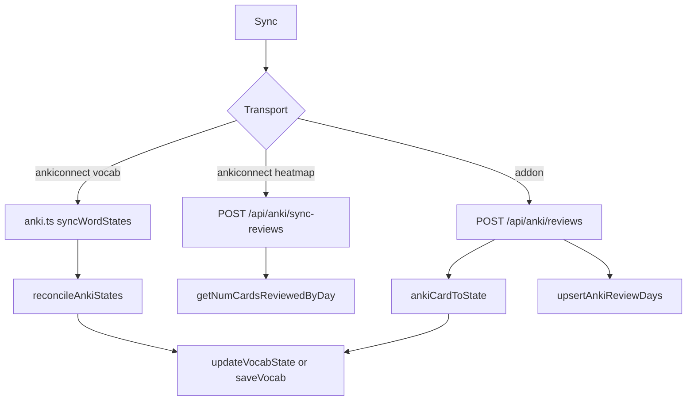

# Anki domain

This domain pushes cards out. It also writes the state of reviews back to Lector. Two transports exist. The Lector Sync add-on is the recommended transport. AnkiConnect is the legacy transport.

The add-on is on AnkiWeb as [Lector Sync](https://ankiweb.net/shared/info/1098736891). The add-on code is `1098736891`. AnkiConnect stays available for a local self-host until Lector retires it.

`useAnkiTransport` in `src/lib/anki-transport.ts` chooses the path. Cloud always uses `addon`. Self-host reads `settings.ankiTransport`. The self-host default is still `ankiconnect`.

## Push to Anki

**App domain:** Anki

Sources: reader drawer, vocab export, practice feedback, transcript line button.

### Key files

| Role | Path | Function |
| --- | --- | --- |
| Transport | `src/lib/anki-transport.ts` | `useAnkiTransport` |
| AnkiConnect (legacy) | `src/lib/anki.ts` | `addWordCard`, `addClozeCard`, `addBasicCard`, `addFormattedNote`, `ankiRequest` |
| Card formats | `src/lib/anki-formats.ts` | `loadAnkiNoteFormats`, `activeNoteFormat`, `renderNoteFields` |
| Card format settings | `src/app/settings/components/AnkiCardFormats/index.tsx` | `AnkiCardFormats` |
| Transcript line | `src/components/AddLineToAnki/index.tsx` | `AddLineToAnki` |
| Line clip | `api/src/routes/lessons.ts`, `api/src/lib/audio-clip.ts` | `GET /:id/clip`, `cutAudioClip` |
| Queue | `src/lib/anki-queue.ts` | `queueForAnki` |
| Reader | `src/app/read/[bookId]/page.tsx` | `addWordToAnki`, `addClozeToAnki`, `addLineToAnki` |
| Vocab | `src/app/vocab/page.tsx` | `handleExportToAnki` |
| Settings | `src/app/settings/components/AnkiSettings/index.tsx` | `AnkiSettings` |
| API | `api/src/routes/anki.ts` | `POST /queue`, `GET /pending`, `POST /ack` |
| Protocol | `api/src/lib/anki-protocol.ts` | `addonProtocol` |
| Add-on | `anki-addon/lector/sync.py` | `apply_pending`, `_upsert_note` |
| Note types | `anki-addon/lector/notetypes.py` | `ensure_models` |

### Branches

- Cloze that cannot wrap the target word fails at queue or at `addClozeCard`.
- Re-queue bumps `anki_pending.version`. An ack that is stale cannot remove the new row.
- When the reader has a `WordSource`, transcript source fields are present.
- The add-on upserts by `LectorId`. The browser uses note types Basic and Cloze with tag `lector`.
- On AnkiConnect, `settings.ankiNoteFormats` can set a word card and a sentence card for each language. Each card uses any note type, and maps its fields to Word, Sentence, Sentence (cloze), Definition, Definition #2, Image, or Pronunciation. The add-on transport ignores this setting.
- A Pronunciation field gets server TTS through `storeMediaFile`. With no server voice, the note is added and the field stays empty.
- A sentence card without a Sentence (cloze) field is not a cloze. The reader then makes the target word optional.
- A transcript line button (AnkiConnect only) sends the line to the sentence card, with the AI phrase translation. `GET /api/lessons/:id/clip` cuts the line from the uploaded audio or video with ffmpeg, as MP3. A YouTube lesson has no media file, so it uses server TTS.
- A line has no target word. A cloze sentence format falls back to a Basic card. Line cards carry the tag `lector-sentence`, not `lector`, so `syncWordStates` never reads them.
- `GET /api/anki` and `POST /api/anki` still proxy AnkiConnect. The web client does not use them for export.

### Tables

`vocab` columns `pushedToAnki` and `ankiNoteId`, plus `anki_pending` and `settings`. Token scopes are `anki:read` and `anki:write` on `api_tokens`.

### Tests

`e2e/reader-anki.spec.ts`, `e2e/vocab-anki-export.spec.ts`, `e2e/anki-addon.spec.ts`, `e2e/anki-card-formats.spec.ts`, `e2e/transcript-line-anki.spec.ts`.

## Sync Anki reviews

**App domain:** Anki

Two writers: vocab state, and heatmap day counts.

| Role | Path | Function |
| --- | --- | --- |
| Client | `src/lib/anki.ts` | `syncWordStates`, `ankiCardToState`, `reconcileAnkiStates` |
| Vocab page | `src/app/vocab/page.tsx` | `handleSyncWithAnki` |
| Stats | `src/app/stats/page.tsx` | `syncAnkiReviews` |
| Client | `src/lib/data-layer.ts` | `syncAnkiReviews` |
| API | `api/src/routes/anki.ts` | `POST /reviews`, `POST /sync-reviews` |
| Add-on | `anki-addon/lector/sync.py` | `post_reviews`, `flush_reviews` |

For a note type in `settings.ankiNoteFormats`, `syncWordStates` reads the word from the field mapped to Word. A card of that note type with an empty Word field is skipped.

Upgrade only. The path never demotes and never touches `ignored`. New Anki cards (`type === 0`) skip. Map: Learning to `level1`, Relearning to `level2`, Young to `level4`, Mature to `known`.

Unreachable AnkiConnect on `/sync-reviews` returns `{ connected: false, synced: 0 }` and does not wipe data.

Tests: `e2e/vocab-anki-sync.spec.ts`, `e2e/anki-stats.spec.ts`.
