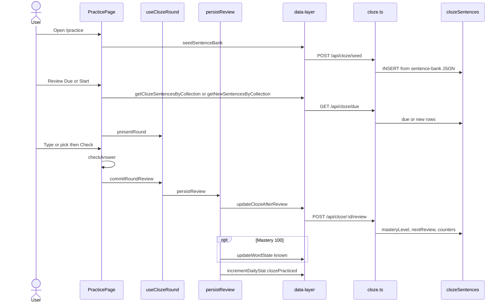
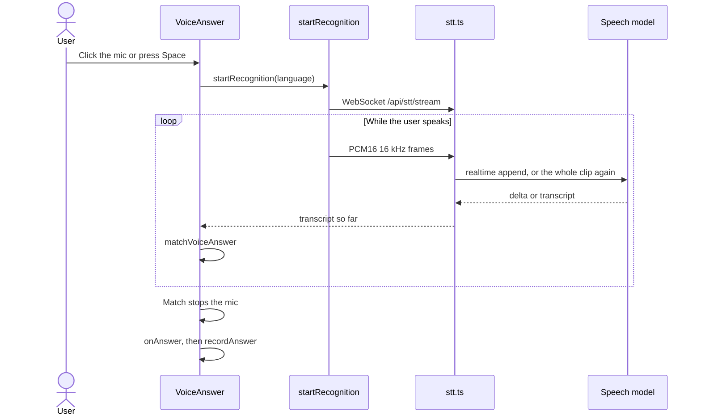
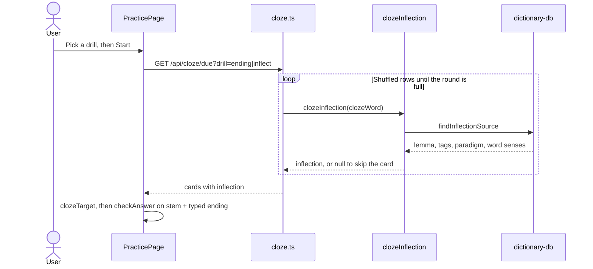

# Practice domain

This domain runs cloze, voice cloze, and dictation with spaced repetition (SRS). Cards live in `clozeSentences`. Mastery 100 also writes the Vocabulary domain.

Intervals in days come from `calculateNextReview`:

| Mastery | Days |
| --- | --- |
| 0 | 0 |
| 25 | 1 |
| 50 | 3 |
| 75 | 7 |
| 100 | 14 |

A correct answer adds 25, cap 100. A miss sets mastery to 0 and re-queues the card in the same round. Retry awards no points. When a mastery 100 card is due, it still appears.

## Practice word

**App domain:** Practice

The user opens `/practice`, picks a collection, then reviews due cards or learns new cards.

### Path

### Key files

| Role | Path | Function |
| --- | --- | --- |
| Page | `src/app/practice/page.tsx` | `startRoundWith`, `handleSubmit`, `handleMcSelect`, `recordAnswer` |
| Round | `src/app/practice/use-cloze-round.ts` | `useClozeRound`, `clozeRoundReducer`, `commitRoundReview` |
| Persist | `src/app/practice/persist-review.ts` | `persistReview` |
| Grade | `src/app/practice/utils.ts` | `checkAnswer`, `normalize`, `calculateNextReview`, `calculatePoints`, `createBlankedSentence`, `buildMultipleChoiceOptions` |
| Feedback | `src/app/practice/components/Feedback/index.tsx` | `Feedback` |
| Client | `src/lib/data-layer.ts` | `seedSentenceBank`, `getClozeSentencesByCollection`, `getNewSentencesByCollection`, `updateClozeAfterReview` |
| API | `api/src/routes/cloze.ts` | `POST /seed`, `GET /due`, `GET /counts`, `POST /:id/review` |
| Bank | `api/src/lib/sentence-bank-*.json` | `loadSentenceBank` |
| Tokens | `api/src/lib/languages.ts` | `resolveClozeTokens` |
| Punct | `src/lib/words.ts` | `splitTrailingPunctuation` |

`GET /due` modes:

- `mode=new`: `reviewCount = 0`
- `mode=review`: `nextReview <= now` and `reviewCount > 0`. This includes mastery 100.
- else: `nextReview <= now`

Blacklisted rows stay out. Order is random. For `drill`, see [Inflection drills](#inflection-drills).

### Branches

- The Type, MC, or Voice mode lives in `localStorage` key `cloze-practice-mode`.
- The Blank drill lives in `localStorage` key `lector-cloze-drill`.
- Type mode can fall back to MC mode for one card. The next card returns to type.
- If `persistReview` fails, the round does not advance.
- Word-state and daily-stat writes are best effort after a saved review.
- Punctuation after the word sits outside the blank. The grade step strips it. The known-word write also strips it.
- The seed step copies rows from Tatoeba in the JSON bank. The seed step also copies mined rows.
- Live `GET /api/tatoeba` is not on this path.
- The UI collections are:
  - `top500`
  - `top1000`
  - `top2000`
- Collection `mined` is for Onboarding only.

### Tables

`clozeSentences`, `knownWords` at mastery 100, and `dailyStats`.

### Tests

`e2e/practice.spec.ts`, `e2e/mc-fallback.spec.ts`, `e2e/cloze-definitions.spec.ts`. Unit: `src/app/practice/__tests__/use-cloze-round.test.ts`, `persist-review.test.ts`.

## Dictation

**App domain:** Practice

Same SRS persist. The user types the full sentence after TTS.

| Role | Path | Function |
| --- | --- | --- |
| Page | `src/app/practice/page.tsx` | `recordDictation`, `handleSetPracticeFormat` |
| Card | `src/app/practice/components/Dictation/DictationCard.tsx` | `DictationCard` |
| Grade | `src/app/practice/utils.ts` | `diffDictation`, `scoreDictation`, `calculateDictationPoints` |
| Speech | `src/lib/tts.ts` | `speak`, `hasAudio` |

Pass threshold is 0.75. Surrender is always a miss. A pack with `pronunciation.audio: 'none'` hides Dictation.

Tests: `e2e/dictation.spec.ts`.

## Voice cloze

**App domain:** Practice

Selfhost only. The user says the missing word or the whole sentence. The transcript shows each word as it arrives.

| Role | Path | Function |
| --- | --- | --- |
| Page | `src/app/practice/page.tsx` | `handleVoiceAnswer`, `handleTypeInstead`, `recordAnswer` |
| Card | `src/app/practice/components/VoiceAnswer/index.tsx` | `VoiceAnswer` |
| Grade | `src/app/practice/utils.ts` | `matchVoiceAnswer` |
| Client | `src/lib/stt/index.ts` | `startRecognition`, `isVoiceInputSupported` |
| Audio | `src/lib/stt/audio.ts` | `Downsampler`, `Endpointer` |
| API | `api/src/routes/stt.ts` | `GET /stream`, `GET /status` |
| Sessions | `api/src/lib/stt.ts` | `resolveSttConfig`, `HttpSttSession`, `RealtimeSttSession` |

### Branches

- Source `asr` uses the `ASR_*` env of audio import. It sends the whole clip to `/v1/audio/transcriptions` again every 400 ms.
- Source `custom` with protocol `realtime` relays to vLLM `/v1/realtime`. Protocol `http` works like `asr`.
- A match on a partial transcript is accepted at once. When the answer word also occurs in another position, the heard word must align with the blank.
- An empty transcript does not use an attempt. The third wrong transcript is a miss. Give up is a miss.
- Type instead switches only this card to typing.
- The endpointer stops the mic after 1.5 s of silence after speech, 8 s with no speech, or 15 s in total. The API keeps at most 30 s of audio.
- Cloud answers `404` on `/api/stt/*`. The Voice mode button does not show.

Tests: `e2e/voice-cloze.spec.ts`. Unit: `src/app/practice/__tests__/voice.test.ts`, `src/lib/stt/audio.test.ts`, `api/src/lib/stt.test.ts`, `api/src/routes/stt.test.ts`.

## Inflection drills

**App domain:** Practice

The Blank menu sits next to Mode. It shows only for a pack with `inflection` in its manifest: `ru` and `el`.

- Whole word: the normal cloze.
- Ending: the stem shows before the blank. The user types the ending.
- Base form: the lemma shows after the blank. A Russian verb shows its aspect pair, for example `(читать / прочитать)`. The user types the full form.

| Role | Path | Function |
| --- | --- | --- |
| Page | `src/app/practice/page.tsx` | `handleSetClozeDrill`, `generateMcOptionsForSentence` |
| Target | `src/app/practice/utils.ts` | `clozeTarget`, `buildInflectionOptions`, `optionLabel` |
| API | `api/src/routes/cloze.ts` | `GET /due` with `drill` |
| Analysis | `api/src/lib/cloze-inflection.ts` | `clozeInflection` |
| Dictionary | `api/src/lib/dictionary-db.ts` | `findInflectionSource` |
| Rules | `languages/inflection.ts` | `isInflectionType`, `splitEnding`, `pickDistractors`, `describeForm`, `aspectPair` |
| Endings | `languages/ru/manifest.ts`, `languages/el/manifest.ts` | `inflection.endings`, `inflection.lemmaEndings` |

### Branches

- A card is kept only when its word is an inflected form in the kaikki `inflections` table. Derivations, aspect links, dated spellings and unaccented aliases do not count.
- A word that is also an adverb, particle, conjunction or preposition is skipped. Russian так and Greek λίγο are examples.
- The Ending drill splits where the form and its lemma share a stem and both leftovers are pack endings (дел+а beside дел+о). An irregular stem takes the longest ending (мог+ла). A zero ending (дел, минут) leaves the card to Base form.
- Multiple choice offers other forms of the same lemma, never a second spelling of the answer's own cell.
- Feedback shows the form's grammar, for example "accusative singular of книга".
- The drill does not change SRS. The card and its mastery are the same as in Whole word.
- Without a dictionary for the language, a drill round is empty.
- The Review Due counts include cards that a drill round skips.

Tests: `e2e/cloze-drills.spec.ts`. Unit: `languages/inflection.test.ts`, `src/app/practice/__tests__/utils.test.ts`, `api/src/routes/cloze-drill.test.ts`.

## Blacklist sentence

**App domain:** Practice

| Role | Path | Function |
| --- | --- | --- |
| Button | `src/app/practice/components/BlacklistSentence/index.tsx` | `handleBlacklist`, `handleUndoBlacklist` |
| Round | `src/app/practice/use-cloze-round.ts` | `blacklistCurrent` |
| Client | `src/lib/data-layer.ts` | `blacklistClozeSentence`, `unblacklistClozeSentence` |
| API | `api/src/routes/cloze.ts` | `PUT /:id` `{ blacklisted }` |

The row stays in the table. Due queries exclude it. Undo does not put the card back in the current round.

## Onboarding cloze

See [Onboarding](onboarding.md). Cards use `source = 'mined'`, `collection = 'mined'`, id `onboarding:{vocabId}`.
